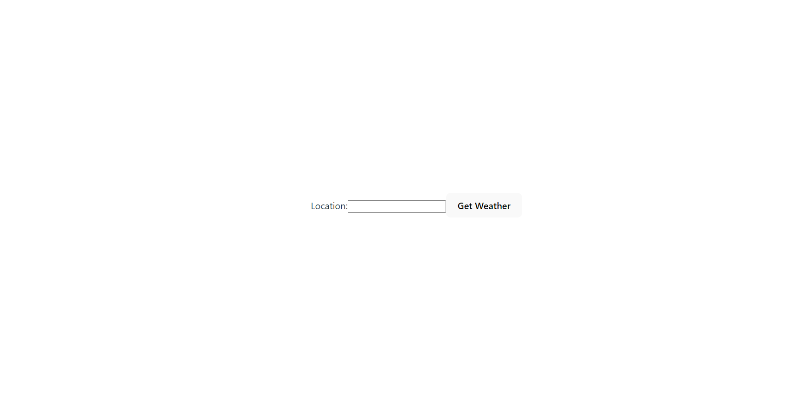
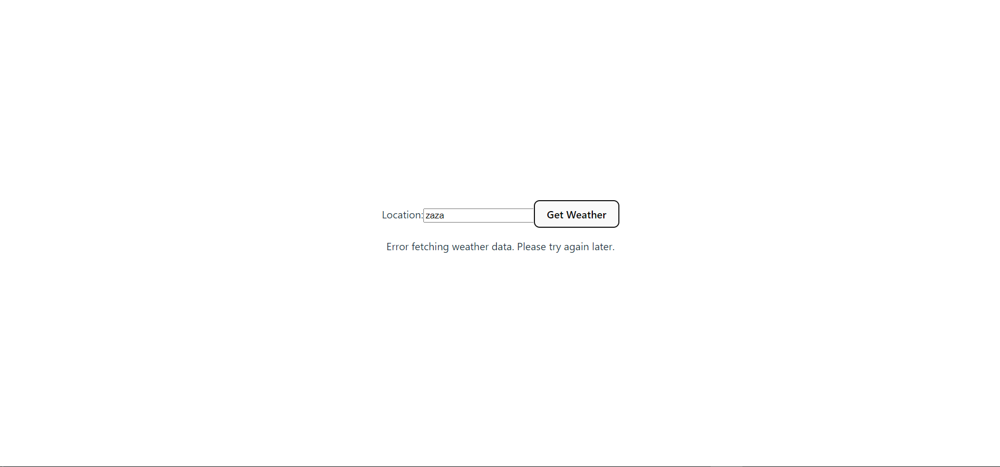
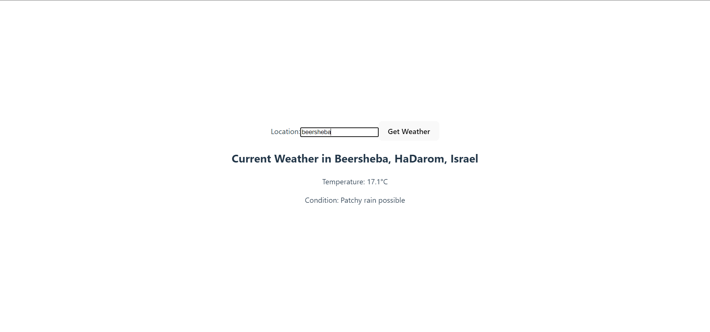
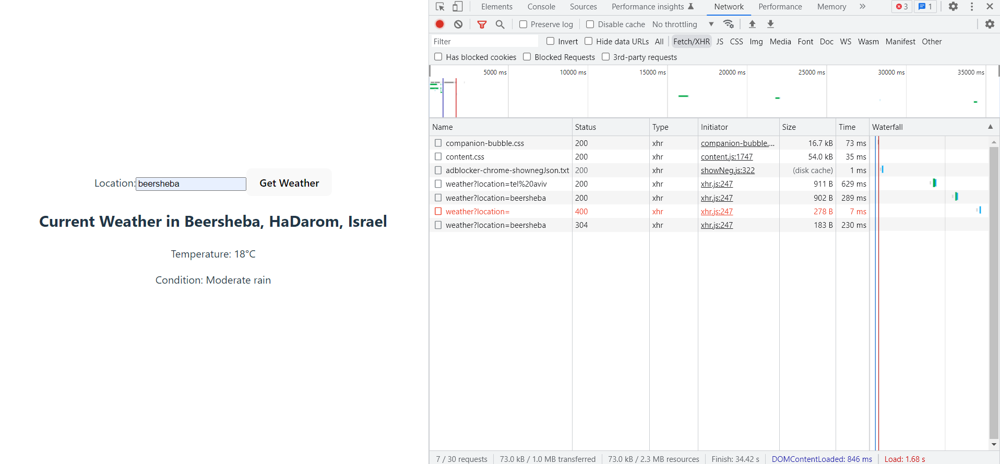

# Front and Back demo App

 

<hr>

## In this app im fetching data from weather API from my server and supplying the data to my React Fronend

-  Front is making a request from server

-  Server is making a request from the api

-  Server give the result to the front

-  Front is displaying data to the user


## Prerequisites
* Node version 16+.
* Vite
* API key from XRapid API
* In `Root` folder run 
```
> npm install
> cd express-react-demo
> npm install
> cd ..
```
* config.env inside the directory `./config` the content should be like this:

```
PORT=5000
NODE_ENV='development'
XRAPID_API_KEY='{your API key}'
```


## How To run the app

- Inside the `Root` directory in the terminal use the command ```npm run dev```
- go to the address showen to you in the terminal, it should look like this:  
```
 ➜  Local:   http://localhost:PORT/ 
```


## For more information and docs about vite
[Vite site link ](https://vitejs.dev/)

<br>

# After running the app it should look like this
 

 

 

 


 


<br>


# Summary
By going through all the steps and making sure you have the prerequisites you:
- Deployed the app locally with all the dependencies needed for both front and back.
- Can make calls to the backend and handle the responses from it.
- Should be able to see data about the weather at your chosen location.

<br>

## `Feel free to contact me`:


[](https://www.linkedin.com/in/elad-harel-06ab61183/)
[](mailto:benben95939@gmail.com)
